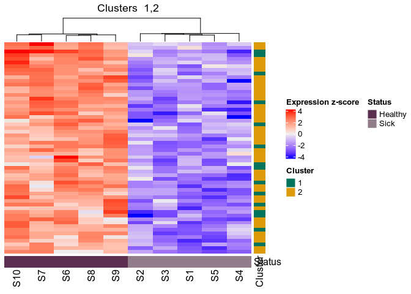
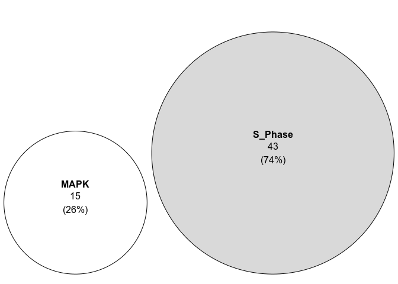
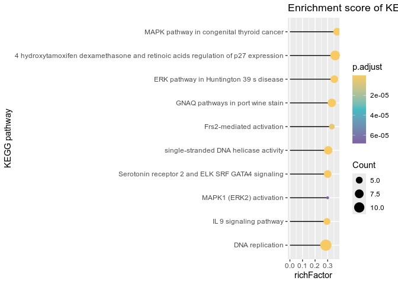
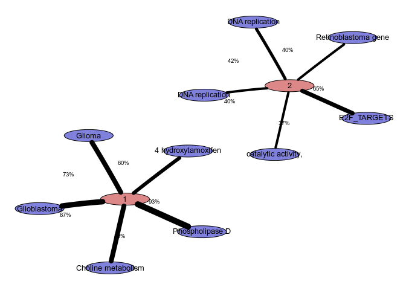
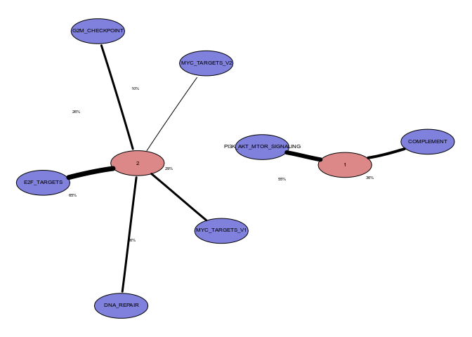
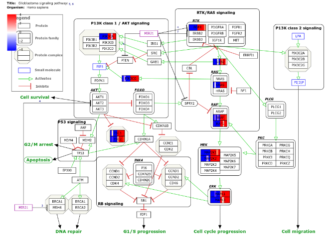
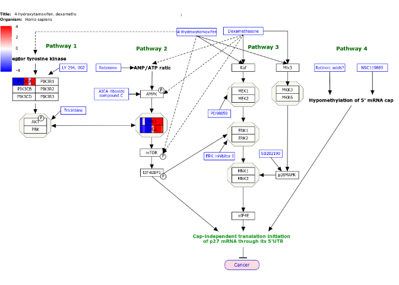
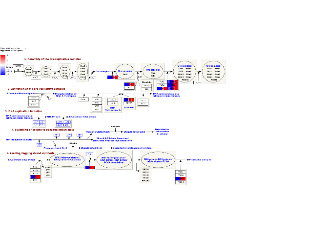

rBioHelp
================
Mathurin Dorel
2024-04-05

A set of functions that implement common operations used when analysing
human biological datasets. Aggregates several packages I like and
versions of datasets I use.

The package provides several helper functions to compare gene clusters
(e.g DEGs after different treatments, coregulated modules, etc).

``` r
    # Simply plot the expression/zscores with sample annotation
    compareClusters(zscores, clusters, 1:2) # TODO have patients_info as argument
```

    ## Warning: The input is a data frame-like object, convert it to a matrix.

<!-- -->

``` r
    customVenn(list(MAPK=geneslist, S_Phase=geneslist2)) # Compare gene sets
```

<!-- -->

``` r
    # Alternative to clusterProfiler::dotplot
    wpenrich = enrichWP(clusters$Entrez, 'Homo sapiens')
    plotEnrichment(wpenrich)
```

<!-- -->

``` r
    # Compute enrichment using multiple gene set sources for each gene group
    suppressMessages(genesetsOverview(clusters)) %>% tail %>% pretty_rich()
```

| ID                                                | Description                                       |    pvalue | genes                          |
|:--------------------------------------------------|:--------------------------------------------------|----------:|:-------------------------------|
| Macroautophagy                                    | Macroautophagy                                    | 0.0146905 | MTOR, TSC2                     |
| Regulation of HSF1-mediated heat shock response   | Regulation of HSF1-mediated heat shock response   | 0.0176852 | MAPK1, MAPK3                   |
| Senescence-Associated Secretory Phenotype (SASP)  | Senescence-Associated Secretory Phenotype (SASP)  | 0.0199697 | MAPK1, MAPK3                   |
| TP53 Regulates Metabolic Genes                    | TP53 Regulates Metabolic Genes                    | 0.0238671 | MTOR, TSC2                     |
| Constitutive Signaling by Aberrant PI3K in Cancer | Constitutive Signaling by Aberrant PI3K in Cancer | 0.0243747 | PIK3CA, PTPN11                 |
| unattributed                                      | Genes not in an enriched gene set                 | 1.0000000 | CDCA7 , CENPU , WDR76 , MRPL36 |

A graph between gene sets helps to better visualise the coverage by the
various gene sets enriched. NOTE: The implementation does not show the
overlaps between the gene sets, which should always be considered when
analysing gene set enrichment results

``` r
    clusters_enrichment = clusters %>% group_by(Cluster) %>%
        group_map(function(xx,yy){genesetsOverview(xx) %>% mutate(Cluster=yy$Cluster) %>% suppressMessages})
    clusterSetsGraph(clusters, clusters_enrichment, top_sets=5, max_sets=50, graphic_scaling=0.8)
```

<!-- -->

``` r
    clusterSetsGraph(clusters, clusters_enrichment %>% lapply(filter, grepl('HALLMARK', ID)),
                     top_sets=10, max_sets=50, graphic_scaling=0.8) # Restrict the plot to hallmark gene sets
```

<!-- -->

Improve wikiprofiler plots, allowing control over the color gradient and
plotting multiple datasets on the same pathway TODO list: - sample name
legend - fix little bug

``` r
    WPmultiplot(zscores %>% column_to_rownames('g'), pathwayid='WP2261')
```

    ## No multi ("Cell_line") column in the data, assuming it is already in wide matrix format

    ## Ensembl IDs detected, automatic conversion to SYMBOL and averaging over identical names.

    ## 'select()' returned 1:1 mapping between keys and columns

<!-- -->

``` r
    WPmultiplot(zscores %>% column_to_rownames('g'), pathwayid='WP3879') # Little bug
```

    ## No multi ("Cell_line") column in the data, assuming it is already in wide matrix format

    ## Ensembl IDs detected, automatic conversion to SYMBOL and averaging over identical names.

    ## 'select()' returned 1:1 mapping between keys and columns

<!-- -->

``` r
    WPmultiplot(zscores %>% column_to_rownames('g'), pathwayid='WP466')
```

    ## No multi ("Cell_line") column in the data, assuming it is already in wide matrix format

    ## Ensembl IDs detected, automatic conversion to SYMBOL and averaging over identical names.

    ## 'select()' returned 1:1 mapping between keys and columns

<!-- -->
